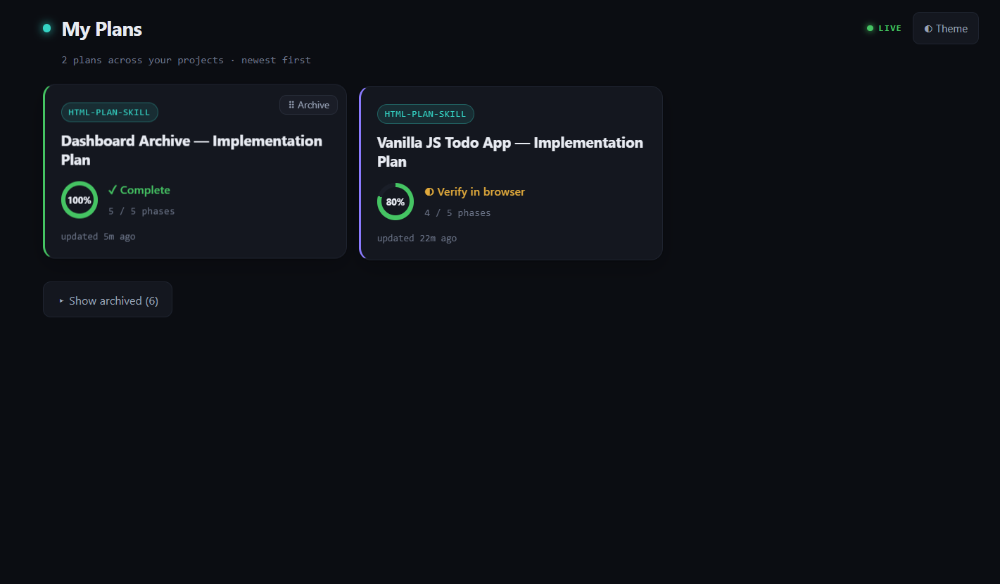

# rich-html-plans skill

A Claude Code skill that turns any plan into a **living document instead of a wall of
text**. Ask Claude to "plan" something and you get a polished, self-contained HTML page —
opened for you automatically — that you can actually *watch*: as Claude works, phases flip
to green and the progress ring fills in real time, so you always know where things stand
without reading a thing.

It's built to get out of your way. Every plan collects into one tidy place, you can launch
the next step straight from the doc, and an optional **live dashboard — private to your
devices over Tailscale — lets you check on every plan across every project from your phone.**
No build step, no dependencies, no clutter in your normal browser.


…and every plan across every project, live on your phone via the optional Tailscale dashboard:



---

## Why use it

Markdown plans scroll off the screen and go stale the moment work starts. This
skill gives every plan a single, shareable artifact that **tracks itself as the
work progresses** and reads like a product spec instead of a wall of text.

### 📊 Live progress tracking
Every build phase gets a status pill (To do / In progress / Done). The sidebar
**progress ring**, the **roadmap**, and the pills all stay in sync from one source
of truth — and the page **auto-refreshes every few seconds**, so as Claude works
through the plan you watch the ring fill and phases flip to green in real time
(complete with a confetti finale). No manual editing, no stale checkboxes.

### 🧭 Built to navigate
A sticky sidebar with **scroll-spy** highlights where you are, the roadmap lets you
jump to any phase, and the hero summarizes the whole effort in a few chips. Long
plans stop being a scroll-fest.

### 🎨 Diagrams instead of walls of text
The skill reaches for a **visual** wherever one helps — data flows, data models,
ordered procedures, A-vs-B trade-offs, and file trees all render as clean,
pre-styled diagrams. A plan ends up mostly pictures, which is far easier to review.

When a plan has real **numbers**, it reaches for **quantitative** charts too:
**effort/before-after bars** (`.hbar`), a **composition stack** showing how a whole
splits into parts (`.stack`), and a **Gantt timeline** with overlap, sequencing, and
a highlighted critical path (`.gantt`). These are static — widths and column spans
are computed at authoring time and baked into the HTML, so there's no runtime JS and
no flicker on the auto-reload.


### 🗂️ Reference sections that travel with the plan
File maps, verification steps, tech-stack tables, and deferred work live right
alongside the phases — so the "how do I prove this works?" answer is never more
than a click away.


### 📦 One file, zero dependencies
The output is a **single HTML file** with all CSS and JS inlined — no CDN, no build
step. It works offline, opens in any browser, and you can drop it in Slack, attach
it to a ticket, or commit it to the repo. Light/dark toggle is built in and
remembered per plan.

###  All your plans in one window
Every plan opens in **one dedicated Chrome window**, pinned to its own profile
(`~/.plan-chrome`) and kept apart from your everyday browsing. The first plan
opens the window; **every plan after it opens as a new tab in that same window**.
So all your plans stay collected side by side as tabs in one place — their own
history, no clutter mixed into your regular browsing. (If Chrome isn't installed,
it falls back to your default browser.)

### ⏳ Tells you when it needs you
When Claude pauses to ask a question mid-build, the plan pops a pulsing **"Waiting
for your input"** banner at the top and flags the browser tab with a ⏳. If you're
watching progress on a second screen, you know the instant it's blocked on a
decision — and clicking the banner jumps you to the section in question.


### 🪜 Sidebar sub-steps
When a phase has a numbered step list, those steps appear as a collapsible
sub-list under the phase in the sidebar — each with its own dot that turns green
as work lands. The active phase auto-expands, the in-progress step glows amber,
and clicking any sub-step jumps straight to it in the body. No extra authoring:
it's built from the step list and progress data already in the plan.


### 🚀 Deep-link buttons — launch Claude Code from the doc
A plan can carry **opt-in buttons that open Claude Code directly**: "⚡ Open repo",
"⏩ Continue plan" (runs the next unfinished phase), and "▶ Start" on each phase.
A waiting question can even render its answer options as buttons, so a
second-monitor reviewer clicks a choice and the session picks up from there. Uses
the `claude-cli://` handler (Claude Code v2.1.91+); buttons simply don't appear if
you don't opt in.


### 🔄 Plan-aware sessions
An optional, one-per-repo **SessionStart hook** makes every new Claude session in
the repo wake up already knowing the newest plan — its path, which phases are
done, what's in progress, and any pending question — by reading the plan's state
and feeding it in as context. It's read-only and stays silent once the plan is
100% done, so finished work never nags unrelated sessions.

### 📱 A live dashboard of all your plans
An optional, off-by-default add-on aggregates **every plan across all your projects** into
**one live link** — a tiny zero-dependency Node server on your PC, exposed privately over
Tailscale — so you can browse newest-first plan cards, with progress rings and a per-card
archive toggle, right from your phone. Status is read live from the plan files, so it's never
stale. Setup is one command; skip it and nothing changes. ([setup below](#optional-a-live-dashboard-of-all-your-plans-phone-friendly))


---

## What's in this package

```
html-plan-skill/
├── README.md                 # this file
├── screenshots/              # the images used above
└── rich-html-plans/          # ← the skill itself (this is what you install)
    ├── SKILL.md              # the skill definition Claude reads
    └── assets/
        ├── plan-template.html      # the HTML template the skill fills in
        ├── session-start-hook.json # the optional plan-aware SessionStart hook
        ├── plans-registry.js       # optional dashboard: central registry of all plans
        ├── plans-server.js         # optional dashboard: zero-dep live server
        └── setup-dashboard.ps1     # optional dashboard: one-time setup (Windows)
```

You only install the **`rich-html-plans/`** folder. The README and screenshots are just
documentation.

---

## Install

Pick **one** of the two locations below, then restart Claude Code.

### Option A — Personal (available in all your projects)

Copy the `rich-html-plans/` folder into your user skills directory:

| OS | Destination |
|----|-------------|
| **Windows** | `C:\Users\<you>\.claude\skills\rich-html-plans\` |
| **macOS / Linux** | `~/.claude/skills/rich-html-plans/` |

PowerShell (Windows) — safe to re-run to update:

```powershell
$dest = "$env:USERPROFILE\.claude\skills\rich-html-plans"
New-Item -ItemType Directory -Force (Split-Path $dest) | Out-Null
Remove-Item -Recurse -Force $dest -ErrorAction SilentlyContinue
Copy-Item -Recurse -Force .\rich-html-plans $dest
```

bash (macOS / Linux) — safe to re-run to update:

```bash
mkdir -p ~/.claude/skills
rm -rf ~/.claude/skills/rich-html-plans
cp -R ./rich-html-plans ~/.claude/skills/rich-html-plans
```

> **Don't** copy with a bare `Copy-Item -Recurse <folder> <dest>` / `cp -R <folder> <dest>` when the
> destination already exists — both **nest** the copy into `rich-html-plans/rich-html-plans/`, which
> Claude won't load. The remove-then-copy form above avoids that and works for both first install and
> updates.

### Option B — Project / team (committed to a repo, shared via git)

Copy the `rich-html-plans/` folder into the repo so everyone who clones it gets the skill:

```
<your-repo>/.claude/skills/rich-html-plans/
```

```bash
mkdir -p .claude/skills
rm -rf .claude/skills/rich-html-plans
cp -R ./rich-html-plans .claude/skills/rich-html-plans
git add .claude/skills/rich-html-plans && git commit -m "Add rich-html-plans skill"
```

---

## Verify it's installed

1. Restart Claude Code (or open the `/hooks` menu, which reloads config).
2. Run `/rich-html-plans` — if it's recognized, the skill loaded.
3. Or just ask Claude to "write up a plan" for something; it should produce an
   HTML file in `Plans/` and open it.

The final HTML is written to a `Plans/` folder in your current project, so make
sure you're running Claude Code from a project directory.

---

## Optional: make plans *always* render as HTML

The skill triggers on its own, but if you want a hard guarantee that every plan
request produces HTML, add a `UserPromptSubmit` hook that reminds Claude. This is
**separate from the skill** and is configured per-machine (or per-repo) in
`settings.json`.

Add this under the top-level object in either `~/.claude/settings.json`
(personal) or `<repo>/.claude/settings.json` (team):

```json
{
  "hooks": {
    "UserPromptSubmit": [
      {
        "hooks": [
          {
            "type": "command",
            "shell": "bash",
            "command": "node -e 'let d=\"\";process.stdin.on(\"data\",c=>d+=c).on(\"end\",()=>{try{process.stdout.write(JSON.parse(d).prompt||\"\")}catch(e){}})' | grep -iqE \"\\b(plans?|planning|planned|roadmaps?|specs?|design[- ]?docs?|write[- ]?ups?)\\b\" && printf \"%s\" \"{\\\"hookSpecificOutput\\\":{\\\"hookEventName\\\":\\\"UserPromptSubmit\\\",\\\"additionalContext\\\":\\\"REMINDER: This request involves a plan. When you finalize or present any implementation/project plan this turn, you MUST render it using the rich-html-plans skill (Skill tool, skill=rich-html-plans) — do not output the plan as plain markdown.\\\"}}\" || true",
            "statusMessage": "Checking for plan request..."
          }
        ]
      }
    ]
  }
}
```

> **Why it's written this way — two gotchas worth knowing:**
>
> 1. **Match the prompt, not the whole event.** A `UserPromptSubmit` hook receives a
>    JSON event on stdin (`{"prompt": "...", "cwd": "...", ...}`), not just your typed
>    text. A bare `grep` reads *all* of stdin — so it also matches your working-directory
>    path. If your repo folder happens to contain "plan" (e.g. `html-plan-skill`), the
>    hook fires on **every** prompt. The `node -e '…JSON.parse(d).prompt…'` step extracts
>    just the prompt first, so only what you actually typed is tested. Node is used
>    because Claude Code already runs on it — no extra dependency to install (unlike
>    `jq`, which isn't on Windows by default).
> 2. **Broadened keywords.** It matches `plan / plans / planning / planned`, plus
>    `roadmap / spec / design doc / write-up` — so synonyms still trigger the skill.
>    Word boundaries (`\b…\b`) keep it from firing on substrings like "specific".
>
> If you already have a `hooks` key in your settings, merge the `UserPromptSubmit`
> entry in rather than replacing the whole block. On Windows the hook relies on the
> Git Bash that ships with Claude Code.

After editing settings, open `/hooks` once or restart Claude Code so the new hook
loads.

---

## Deep links & plan-aware sessions

Two extra capabilities are driven by the skill itself — you don't configure them,
you just ask for them:

- **Deep-link buttons** are opt-in per plan. Ask Claude to "add deep links" (or it
  offers them when a working directory is known) and the plan gets "Open repo",
  "Continue plan", and per-phase "Start" buttons that launch Claude Code via the
  `claude-cli://` handler. Requires **Claude Code v2.1.91+**; the handler
  auto-registers on the first interactive `claude` run. Buttons work from the
  opened `file://` doc — GitHub strips the scheme, so they're not for pasting into
  a README.

  > **Gotcha — invalid wildcard permission rules halt the new session.** A deep link
  > opens a *fresh* Claude Code session that loads your `settings.json`. Current
  > Claude Code rejects **bare** wildcard permission rules like `Bash(*)`, `Edit(*)`,
  > or `Read(*)` ("wildcard is not allowed"), and the new session stops on its first
  > tool call until you fix them. The allow-all form is just the **bare tool name** —
  > `"Bash"`, `"Edit"`, `"Read"` — and prefix rules like `"Bash(npm run *)"` are fine.
  > If "Continue plan" flashes open and stalls, check your allow-list for `Tool(*)`
  > entries.
- **The plan-aware SessionStart hook** (`rich-html-plans/assets/session-start-hook.json`)
  is installed once per repo. Claude merges it into the repo's
  `.claude/settings.json` when you ask it to set up plan-aware sessions; from then
  on every session in that repo starts knowing the newest plan's state. It's
  read-only, dependency-free (PowerShell on Windows), and silent once the plan is
  done. As with any new hook, it takes effect after you open `/hooks` once or
  restart.

---

## Optional: a live dashboard of all your plans (phone-friendly)

Plans pile up across many projects, each in its own `Plans/` folder. This **opt-in**
add-on gives you **one live link** — served by a tiny zero-dependency Node server on your
PC and exposed privately over **Tailscale** — that lists every plan you've made, newest
first, with each full plan readable right on your phone. Status is read live from the plan
files, so it's never stale; tap a card and the plan's own auto-refresh keeps it current.

It is **entirely optional and off by default.** The skill only registers a plan if the
registry file already exists, so if you never run the setup below, nothing changes.


### How it works

```
phone (Tailscale app, same tailnet)
   │  https://<your-machine>.<tailnet>.ts.net
   ▼
tailscale serve  →  Node server (localhost)  ──reads──►  ~/.claude/plans-index.json   (registry)
                         │                                 each project's Plans/*-plan.html  (live)
   GET /         dashboard: newest-first cards
   GET /plan/:id full plan from disk (its 4s reload makes it live over HTTP)
   GET /api/plans JSON the dashboard polls to refresh cards
```

- **Registry** `~/.claude/plans-index.json` — just the *locations* of your plans
  (`id`, `title`, `project`, `path`). Its existence is the on/off switch.
- **Server** `assets/plans-server.js` — Node built-ins only, no `npm install`.
- **Status is never duplicated** — the server re-reads each plan's `#plan-state` per request.

### Prerequisites

1. **Node.js** on your PATH (`node --version`).
2. **Tailscale** installed and signed in on **both** this PC and your phone, on the **same
   tailnet** (the free plan is fine). Install the Tailscale app on your phone from its app store.
3. **Tailscale Serve + HTTPS enabled once** in your admin console (Serve needs an HTTPS cert
   for your machine name):
   - In **[admin → DNS](https://login.tailscale.com/admin/dns)**: enable **MagicDNS**, then
     **Enable HTTPS**.
   - If `tailscale serve` reports *"Serve is not enabled on your tailnet,"* open the link it
     prints (e.g. `https://login.tailscale.com/f/serve?node=...`) and approve it. Then re-run
     the setup (or just `tailscale serve --bg <port>`).

### Setup (Windows — one time)

From the skill's `assets/` folder:

```powershell
# -Root tells it where to scan for existing plans to seed the registry (defaults to the
# current folder). Point it at wherever your projects live.
powershell -ExecutionPolicy Bypass -File .\setup-dashboard.ps1 -Root $HOME\Desktop
```

This will:
1. **Enable + seed** the registry (`~/.claude/plans-index.json`) from any `Plans/*-plan.html`
   it finds under `-Root`.
2. **Register a logon Scheduled Task** so the server auto-starts and survives reboots.
3. Run **`tailscale serve --bg <port>`** to expose it privately (tailnet-only — *not* the
   public `funnel`).
4. **Print the URL** to open on your phone, e.g. `https://your-pc.tailXXXX.ts.net/`.

Open that URL on your phone (signed into the same tailnet) and you'll see all your plans.
**New plans register automatically** from then on; re-run the script anytime to re-seed.

> **Persistence without admin.** Registering the logon Scheduled Task may fail with *"Access is
> denied"* on locked-down machines. The script automatically falls back to a per-user
> **Startup-folder launcher** (`RichHtmlPlansDashboard.vbs`) that starts the server hidden at
> every logon — no elevation required. To get the Scheduled Task instead, re-run the script from
> an **elevated** PowerShell.

To remove it later: `powershell -File .\setup-dashboard.ps1 -Uninstall` (removes the task and
the serve rule; leaves the registry).

### macOS / Linux

The server and registry are cross-platform (`node plans-server.js`); only the setup script
is Windows-specific. On macOS/Linux, run the server under **launchd**/**systemd** (or just
`node plans-server.js &`) and expose it with the same `tailscale serve --bg <port>`. Seed the
registry once with `node plans-registry.js init`, then `node plans-registry.js add <plan.html>`
per plan (the skill does this for you on each new plan).

### Notes & limits (v1)

- **Tailnet-private**, not public — only your signed-in devices can reach the link. No extra
  password (Tailscale's network ACLs are the boundary).
- **Read-only on status** — you view progress and open plans; you don't flip phase
  statuses from the phone. The one exception is **archiving**: each card has a hover
  **⠿ Archive** button (↩ Unarchive on archived cards) that tucks finished plans behind
  a **"Show archived (N)"** toggle. Archiving only flags the plan's registry entry
  (`"archived": true`) — the plan file is never touched — and is fully reversible, from
  the card or the CLI (`node plans-registry.js archive <id>` / `unarchive <id>`).
- **Per-machine** — the registry lists plans on *this* PC; it doesn't merge multiple machines.

---

## Updating later

This is a one-off copy. If the skill is improved, **re-run the same install command** from the
[Install](#install) section — the remove-then-copy form replaces the installed copy cleanly (a plain
`Copy-Item`/`cp -R` would instead nest it as `rich-html-plans/rich-html-plans/`, leaving the old
version live). For automatic updates, package it as a Claude Code plugin/marketplace instead.
