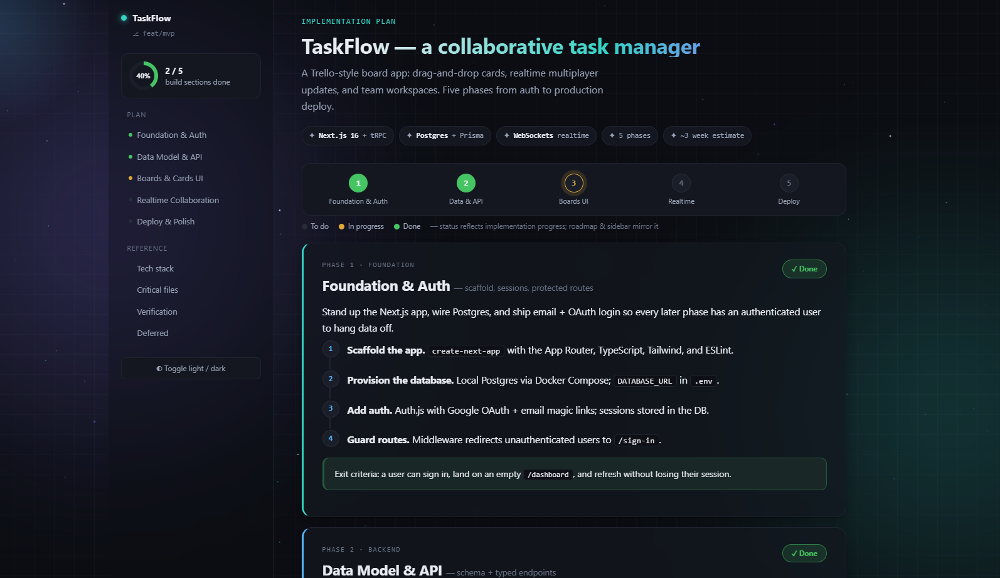
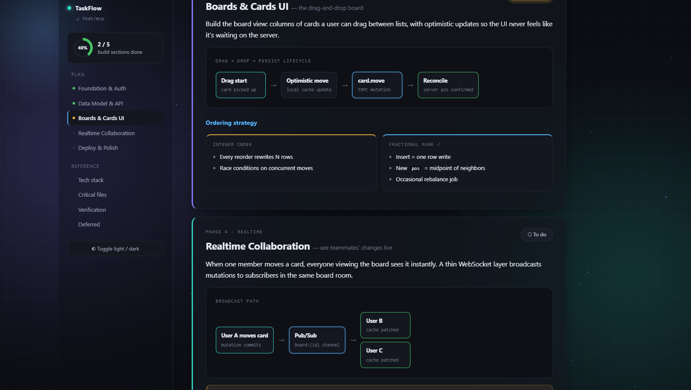
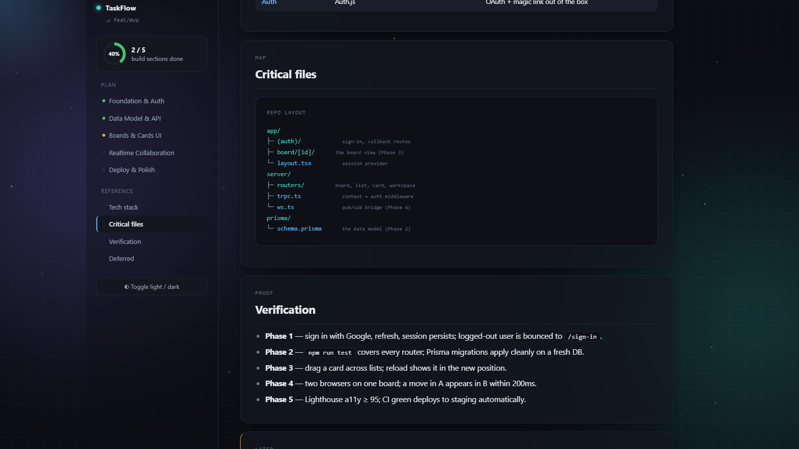
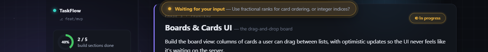
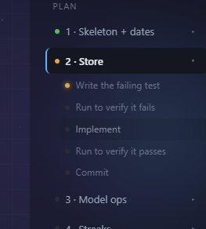
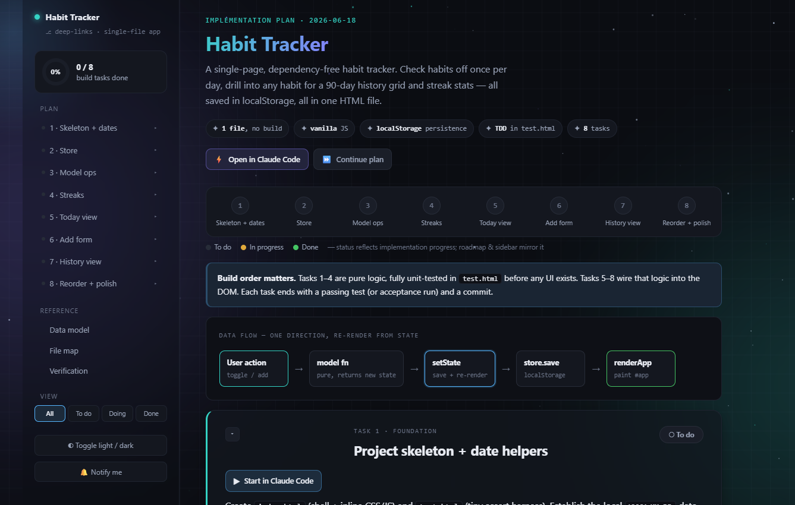
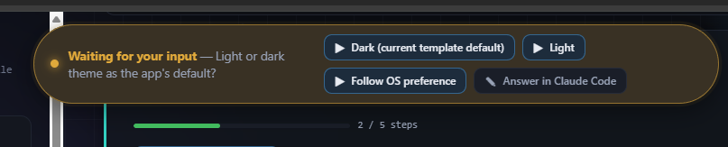

# rich-html-plans skill

A Claude Code skill that turns any implementation or project plan into a polished,
**self-contained HTML document** — sticky sidebar nav with scroll-spy, a phase
roadmap, a live progress tracker, rich diagrams, and a light/dark toggle — then
saves it to `Plans/` and opens it in Chrome — every plan collected in one
dedicated Chrome window, kept separate from your normal browsing.

It triggers automatically when you ask Claude to "plan", "make a plan", "write up
the plan", or otherwise finalize a multi-phase plan.



---

## Why use it

Markdown plans scroll off the screen and go stale the moment work starts. This
skill gives every plan a single, shareable artifact that **tracks itself as the
work progresses** and reads like a product spec instead of a wall of text.

### 📊 Live progress tracking
Every build phase gets a status pill (To do / In progress / Done). The sidebar
**progress ring**, the **roadmap**, and the pills all stay in sync from one source
of truth — and the page **auto-refreshes every few seconds**, so as Claude works
through the plan you watch the ring fill and phases flip to green in real time
(complete with a confetti finale). No manual editing, no stale checkboxes.

### 🧭 Built to navigate
A sticky sidebar with **scroll-spy** highlights where you are, the roadmap lets you
jump to any phase, and the hero summarizes the whole effort in a few chips. Long
plans stop being a scroll-fest.

### 🎨 Diagrams instead of walls of text
The skill reaches for a **visual** wherever one helps — data flows, data models,
ordered procedures, A-vs-B trade-offs, and file trees all render as clean,
pre-styled diagrams. A plan ends up mostly pictures, which is far easier to review.



### 🗂️ Reference sections that travel with the plan
File maps, verification steps, tech-stack tables, and deferred work live right
alongside the phases — so the "how do I prove this works?" answer is never more
than a click away.



### 📦 One file, zero dependencies
The output is a **single HTML file** with all CSS and JS inlined — no CDN, no build
step. It works offline, opens in any browser, and you can drop it in Slack, attach
it to a ticket, or commit it to the repo. Light/dark toggle is built in and
remembered per plan.

###  All your plans in one window
Every plan opens in **one dedicated Chrome window**, pinned to its own profile
(`~/.plan-chrome`) and kept apart from your everyday browsing. The first plan
opens the window; **every plan after it opens as a new tab in that same window**.
So all your plans stay collected side by side as tabs in one place — their own
history, no clutter mixed into your regular browsing. (If Chrome isn't installed,
it falls back to your default browser.)

### ⏳ Tells you when it needs you
When Claude pauses to ask a question mid-build, the plan pops a pulsing **"Waiting
for your input"** banner at the top and flags the browser tab with a ⏳. If you're
watching progress on a second screen, you know the instant it's blocked on a
decision — and clicking the banner jumps you to the section in question.



### 🪜 Sidebar sub-steps
When a phase has a numbered step list, those steps appear as a collapsible
sub-list under the phase in the sidebar — each with its own dot that turns green
as work lands. The active phase auto-expands, the in-progress step glows amber,
and clicking any sub-step jumps straight to it in the body. No extra authoring:
it's built from the step list and progress data already in the plan.



### 🚀 Deep-link buttons — launch Claude Code from the doc
A plan can carry **opt-in buttons that open Claude Code directly**: "⚡ Open repo",
"⏩ Continue plan" (runs the next unfinished phase), and "▶ Start" on each phase.
A waiting question can even render its answer options as buttons, so a
second-monitor reviewer clicks a choice and the session picks up from there. Uses
the `claude-cli://` handler (Claude Code v2.1.91+); buttons simply don't appear if
you don't opt in.





### 🔄 Plan-aware sessions
An optional, one-per-repo **SessionStart hook** makes every new Claude session in
the repo wake up already knowing the newest plan — its path, which phases are
done, what's in progress, and any pending question — by reading the plan's state
and feeding it in as context. It's read-only and stays silent once the plan is
100% done, so finished work never nags unrelated sessions.

---

## What's in this package

```
html-plan-skill/
├── README.md                 # this file
├── screenshots/              # the images used above
└── rich-html-plans/          # ← the skill itself (this is what you install)
    ├── SKILL.md              # the skill definition Claude reads
    └── assets/
        ├── plan-template.html      # the HTML template the skill fills in
        └── session-start-hook.json # the optional plan-aware SessionStart hook
```

You only install the **`rich-html-plans/`** folder. The README and screenshots are just
documentation.

---

## Install

Pick **one** of the two locations below, then restart Claude Code.

### Option A — Personal (available in all your projects)

Copy the `rich-html-plans/` folder into your user skills directory:

| OS | Destination |
|----|-------------|
| **Windows** | `C:\Users\<you>\.claude\skills\rich-html-plans\` |
| **macOS / Linux** | `~/.claude/skills/rich-html-plans/` |

PowerShell (Windows):

```powershell
Copy-Item -Recurse -Force .\rich-html-plans "$env:USERPROFILE\.claude\skills\rich-html-plans"
```

bash (macOS / Linux):

```bash
mkdir -p ~/.claude/skills && cp -R ./rich-html-plans ~/.claude/skills/rich-html-plans
```

### Option B — Project / team (committed to a repo, shared via git)

Copy the `rich-html-plans/` folder into the repo so everyone who clones it gets the skill:

```
<your-repo>/.claude/skills/rich-html-plans/
```

```bash
mkdir -p .claude/skills && cp -R ./rich-html-plans .claude/skills/rich-html-plans
git add .claude/skills/rich-html-plans && git commit -m "Add rich-html-plans skill"
```

---

## Verify it's installed

1. Restart Claude Code (or open the `/hooks` menu, which reloads config).
2. Run `/rich-html-plans` — if it's recognized, the skill loaded.
3. Or just ask Claude to "write up a plan" for something; it should produce an
   HTML file in `Plans/` and open it.

The final HTML is written to a `Plans/` folder in your current project, so make
sure you're running Claude Code from a project directory.

---

## Optional: make plans *always* render as HTML

The skill triggers on its own, but if you want a hard guarantee that every plan
request produces HTML, add a `UserPromptSubmit` hook that reminds Claude. This is
**separate from the skill** and is configured per-machine (or per-repo) in
`settings.json`.

Add this under the top-level object in either `~/.claude/settings.json`
(personal) or `<repo>/.claude/settings.json` (team):

```json
{
  "hooks": {
    "UserPromptSubmit": [
      {
        "hooks": [
          {
            "type": "command",
            "shell": "bash",
            "command": "node -e 'let d=\"\";process.stdin.on(\"data\",c=>d+=c).on(\"end\",()=>{try{process.stdout.write(JSON.parse(d).prompt||\"\")}catch(e){}})' | grep -iqE \"\\b(plans?|planning|planned|roadmaps?|specs?|design[- ]?docs?|write[- ]?ups?)\\b\" && printf \"%s\" \"{\\\"hookSpecificOutput\\\":{\\\"hookEventName\\\":\\\"UserPromptSubmit\\\",\\\"additionalContext\\\":\\\"REMINDER: This request involves a plan. When you finalize or present any implementation/project plan this turn, you MUST render it using the rich-html-plans skill (Skill tool, skill=rich-html-plans) — do not output the plan as plain markdown.\\\"}}\" || true",
            "statusMessage": "Checking for plan request..."
          }
        ]
      }
    ]
  }
}
```

> **Why it's written this way — two gotchas worth knowing:**
>
> 1. **Match the prompt, not the whole event.** A `UserPromptSubmit` hook receives a
>    JSON event on stdin (`{"prompt": "...", "cwd": "...", ...}`), not just your typed
>    text. A bare `grep` reads *all* of stdin — so it also matches your working-directory
>    path. If your repo folder happens to contain "plan" (e.g. `html-plan-skill`), the
>    hook fires on **every** prompt. The `node -e '…JSON.parse(d).prompt…'` step extracts
>    just the prompt first, so only what you actually typed is tested. Node is used
>    because Claude Code already runs on it — no extra dependency to install (unlike
>    `jq`, which isn't on Windows by default).
> 2. **Broadened keywords.** It matches `plan / plans / planning / planned`, plus
>    `roadmap / spec / design doc / write-up` — so synonyms still trigger the skill.
>    Word boundaries (`\b…\b`) keep it from firing on substrings like "specific".
>
> If you already have a `hooks` key in your settings, merge the `UserPromptSubmit`
> entry in rather than replacing the whole block. On Windows the hook relies on the
> Git Bash that ships with Claude Code.

After editing settings, open `/hooks` once or restart Claude Code so the new hook
loads.

---

## Deep links & plan-aware sessions

Two extra capabilities are driven by the skill itself — you don't configure them,
you just ask for them:

- **Deep-link buttons** are opt-in per plan. Ask Claude to "add deep links" (or it
  offers them when a working directory is known) and the plan gets "Open repo",
  "Continue plan", and per-phase "Start" buttons that launch Claude Code via the
  `claude-cli://` handler. Requires **Claude Code v2.1.91+**; the handler
  auto-registers on the first interactive `claude` run. Buttons work from the
  opened `file://` doc — GitHub strips the scheme, so they're not for pasting into
  a README.

  > **Gotcha — invalid wildcard permission rules halt the new session.** A deep link
  > opens a *fresh* Claude Code session that loads your `settings.json`. Current
  > Claude Code rejects **bare** wildcard permission rules like `Bash(*)`, `Edit(*)`,
  > or `Read(*)` ("wildcard is not allowed"), and the new session stops on its first
  > tool call until you fix them. The allow-all form is just the **bare tool name** —
  > `"Bash"`, `"Edit"`, `"Read"` — and prefix rules like `"Bash(npm run *)"` are fine.
  > If "Continue plan" flashes open and stalls, check your allow-list for `Tool(*)`
  > entries.
- **The plan-aware SessionStart hook** (`rich-html-plans/assets/session-start-hook.json`)
  is installed once per repo. Claude merges it into the repo's
  `.claude/settings.json` when you ask it to set up plan-aware sessions; from then
  on every session in that repo starts knowing the newest plan's state. It's
  read-only, dependency-free (PowerShell on Windows), and silent once the plan is
  done. As with any new hook, it takes effect after you open `/hooks` once or
  restart.

---

## Updating later

This is a one-off copy. If the skill is improved, re-copy the updated `rich-html-plans/`
folder over the installed one. For automatic updates, package it as a Claude Code
plugin/marketplace instead.
